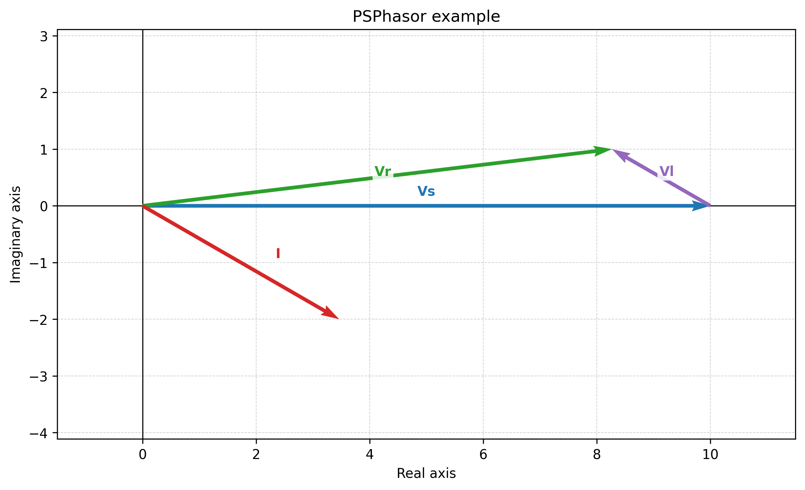

# PSPhasor

PSPhasor is a small Python package for drawing phasor diagrams with Matplotlib.
It supports polar input, Cartesian input, and phasors referenced from previously
drawn phasors.



## Features

- Draw phasors from magnitude/angle or explicit start/end coordinates.
- Start a phasor from the start or end of another phasor.
- Store each phasor as a typed `Phasor` object with magnitude, angle, and
  component properties.
- Preserve older dictionary-style reads such as `phasor["magnitude"]`.
- Fit plots without the excessive blank canvas that can happen with equal
  aspect Matplotlib axes.
- Save diagrams directly to image files.

## Installation

Install from PyPI:

```bash
python -m pip install PSPhasor
```

For local development:

```bash
python -m pip install -e ".[dev]"
```

## Quick Start

```python
from PSPhasor import PhasorManager

manager = PhasorManager(figsize=(9, 5), title="Series phasor diagram")

source = manager.draw_phasor(
    "Vs",
    magnitude=10,
    angle=0,
    label_offset=(0.0, 0.25),
)
manager.draw_phasor(
    "Vl",
    magnitude=2,
    angle=150,
    start_ref="Vs",
    ref_point="end",
    color="tab:purple",
)
manager.draw_phasor(
    "Vr",
    start_x=0,
    start_y=0,
    end_x=8.27,
    end_y=1.0,
    color="tab:green",
)
manager.draw_phasor(
    "I",
    magnitude=4,
    angle=-30,
    phasor_type="current",
    label_offset=(0.65, 0.15),
)

print(f"{source.name}: {source.magnitude:.2f} at {source.angle_deg:.1f} deg")
manager.save("phasor_diagram.png")
manager.show()
```

## API

### `PhasorManager`

```python
PhasorManager(
    figsize=(9.0, 5.0),
    title="Phasor Diagram",
    xlabel="Real axis",
    ylabel="Imaginary axis",
)
```

Main methods:

- `draw_phasor(...) -> Phasor`: draw and store a phasor.
- `get_phasor(name) -> Phasor | None`: return a stored phasor.
- `fit(margin=0.15, equal_aspect=True)`: fit axes around all phasors.
- `save(filename, dpi=300) -> Path`: save the current diagram.
- `show()`: display the current diagram.
- `clear()`: remove all stored phasors and reset the plot.

### `draw_phasor`

```python
manager.draw_phasor(
    name,
    magnitude=None,
    angle=None,
    *,
    start_ref="abs",
    start_x=0.0,
    start_y=0.0,
    end_x=None,
    end_y=None,
    ref_point="end",
    phasor_type="voltage",
    color=None,
    label_offset=0.1,
    arrow_width=0.005,
    label=None,
    metadata=None,
)
```

Use exactly one geometry mode:

- Polar: provide `magnitude` and `angle`.
- Cartesian: provide `end_x` and `end_y`.

Set `start_ref` to the name of an existing phasor to start from that phasor.
Use `ref_point="start"` or `ref_point="end"` to choose the reference point.

### `Phasor`

`draw_phasor` returns a `Phasor` object:

```python
phasor = manager.draw_phasor("Vs", magnitude=10, angle=0)

phasor.magnitude
phasor.angle_deg
phasor.start
phasor.end
phasor.dx
phasor.dy
```

Dictionary-style access is also supported for compatibility:

```python
phasor["magnitude"]
phasor["angle_deg"]
phasor["end_x"]
```

## Development

Run the test suite:

```bash
python -m pytest
```

Run lint checks:

```bash
ruff check .
```

## License

This project is licensed under the MIT License. See `LICENSE` for details.
